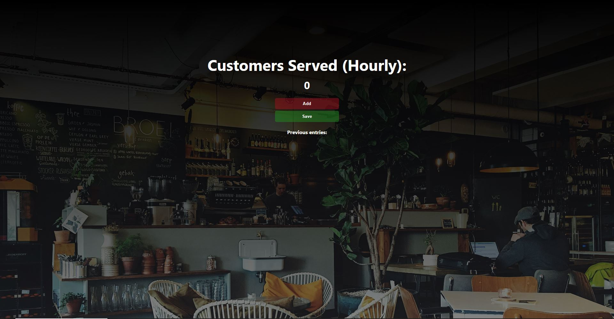

# ☕ Cafe Counter

A simple, clean web app to track the number of customers served hourly at a café.  
Built with vanilla HTML, CSS, and JavaScript.

[🌐 Live Demo](https://tangerine-semifreddo-a6b32b.netlify.app/)

---

## 📸 Screenshot

  

---

## 🎯 Features

- Real-time customer count display
- “Add” button increments the current hourly count
- “Save” button logs the hourly count into a list of previous entries
- Clean and responsive design with background image and hover effects

---

## 🛠️ Tech Stack

- **HTML5** – Markup structure
- **CSS3** – Styling and layout with gradients and responsive design
- **JavaScript** – DOM manipulation and app logic
- **Netlify** – Deployed static hosting

---

## 🚀 Getting Started

To run this app locally:

### 1. Clone the repository

git clone https://github.com/zandernh/cafe-counter.git

cd cafe-counter

### 2. Open in browser
Just open index.html in your browser. No build tools or installations required.

---

## 🧠 How It Works
The Add button increases the current count on the screen.

The Save button appends the current count to a list of previous entries and resets the counter to zero.

Styling includes hover states and a café-themed background image.

---

## 📂 File Structure

cafe-counter/

├── index.html       # Main HTML file

├── index.css        # Styling for layout and buttons

├── index.js         # JavaScript logic for counter

└── cafe.jpg         # Background image (optional)

---

## 📦 Deployment
The app is deployed using Netlify.

---

## 📄 License
This project is open-source and free to use under the MIT License.

---

## 🙋‍♂️ Author

Built by Zander Harding
